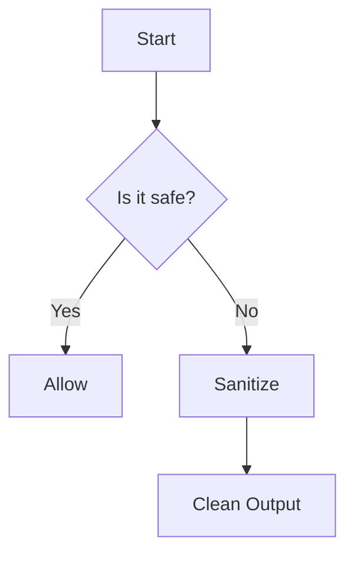

# Bluemonday Security Test

This post tests HTML sanitization with Bluemonday.

## Safe HTML (should be preserved)

This is **bold text** and this is *italic text*.

- List item 1
- List item 2

```go
package main
import "fmt"
func main() {
    fmt.Println("Hello, World!")
}
```

## Potentially Dangerous HTML (should be sanitized)

<script>alert('XSS Attack!')</script>


<a href="javascript:alert('XSS')">Click me</a>

<iframe src="malicious-site.com"></iframe>

## Mermaid Diagram (should be preserved)



## Conclusion

Bluemonday should sanitize dangerous HTML while preserving safe formatting and code blocks.
