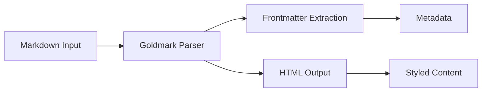

# Setting Up Goldmark with Extensions

Goldmark is a fast and extensible Markdown parser for Go. In this post, I'll show you how to set it up with YAML frontmatter parsing and various useful extensions.

## Why Goldmark?

Goldmark offers several advantages:

- **Fast** - Written in Go with excellent performance
- **Extensible** - Easy to add custom extensions
- **Standards Compliant** - Follows CommonMark specification
- **Active Development** - Well maintained and updated regularly

## Required Dependencies

First, let's add the necessary dependencies to your `go.mod`:

```go
require (
    github.com/yuin/goldmark v1.7.13
    github.com/yuin/goldmark/extension v1.0.0
    github.com/yuin/goldmark-highlighting/v2 v2.0.0
    go.abhg.dev/goldmark/frontmatter v0.2.0
    go.abhg.dev/goldmark/mermaid v0.6.0
    github.com/alecthomas/chroma/v2 v2.2.0
    gopkg.in/yaml.v3 v3.0.1
)
```

## Basic Setup

Here's how to create a basic Goldmark parser:

```go
package main

import (
    "bytes"
    "github.com/yuin/goldmark"
    "github.com/yuin/goldmark/extension"
    goldmarkHTML "github.com/yuin/goldmark/renderer/html"
    highlighting "github.com/yuin/goldmark-highlighting/v2"
    "go.abhg.dev/goldmark/frontmatter"
    "go.abhg.dev/goldmark/mermaid"
)

func createMarkdownParser() goldmark.Markdown {
    return goldmark.New(
        goldmark.WithExtensions(
            &frontmatter.Extender{},
            extension.GFM,
            highlighting.NewHighlighting(
                highlighting.WithStyle("monokai"),
            ),
            &mermaid.Extender{},
        ),
        goldmark.WithRendererOptions(
            goldmarkHTML.WithUnsafe(),
        ),
    )
}
```

## Frontmatter Structure

Define your frontmatter structure:

```go
type Frontmatter struct {
    Title       string    `yaml:"title"`
    Date        time.Time `yaml:"date"`
    Tags        []string  `yaml:"tags"`
    Description string    `yaml:"description"`
    Cover       string    `yaml:"cover"`
    Draft       bool      `yaml:"draft"`
    Slug        string    `yaml:"slug"`
}
```

## Features Included

This setup includes:

- ✅ **YAML Frontmatter** - Parse metadata from content
- ✅ **GitHub Flavored Markdown** - Tables, strikethrough, task lists
- ✅ **Syntax Highlighting** - Code blocks with Chroma
- ✅ **Mermaid Diagrams** - Flowcharts and diagrams
- ✅ **Auto-linking** - Automatic URL detection
- ✅ **Emoji Support** - Unicode emoji rendering

## Example Usage

```go
func parseContent(content []byte) (*Content, error) {
    parser := createMarkdownParser()
    ctx := parser.NewContext()
    
    var html bytes.Buffer
    if err := parser.Convert(content, &html, parser.WithContext(ctx)); err != nil {
        return nil, err
    }
    
    // Extract frontmatter
    fm := frontmatter.Get(ctx)
    var meta Frontmatter
    if err := fm.Decode(&meta); err != nil {
        return nil, err
    }
    
    return &Content{
        Frontmatter: meta,
        HTML: html.String(),
    }, nil
}
```

## Conclusion

Goldmark with these extensions provides a powerful and flexible Markdown processing solution for Go applications. The combination of frontmatter parsing, syntax highlighting, and diagram support makes it ideal for content management systems and documentation sites.



Happy coding! 🚀
