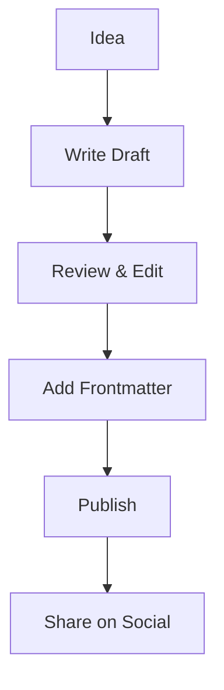

# Welcome to My Blog!

This is my very first blog post. I'm excited to share my thoughts and experiences with you.

## What You Can Expect

In this blog, I'll be writing about:

- **Technology** - Programming, web development, and software engineering
- **Personal Projects** - Things I'm building and learning
- **Tutorials** - Step-by-step guides for various topics
- **Thoughts** - Random musings and reflections

## Code Example

Here's a simple Go function to get us started:

```go
package main

import "fmt"

func main() {
    fmt.Println("Hello, World!")
}
```

## Mermaid Diagram

Here's a simple flowchart showing my blogging process:



## Task List

Here are some things I want to accomplish this year:

- [ ] Write at least 24 blog posts
- [ ] Learn a new programming language
- [ ] Build a side project
- [x] Set up this blog

## Conclusion

Thanks for reading! I hope you'll stick around for more content. Feel free to reach out if you have any questions or suggestions.

---

*This post was written with full YAML frontmatter support and Goldmark extensions including syntax highlighting, Mermaid diagrams, and task lists.*
