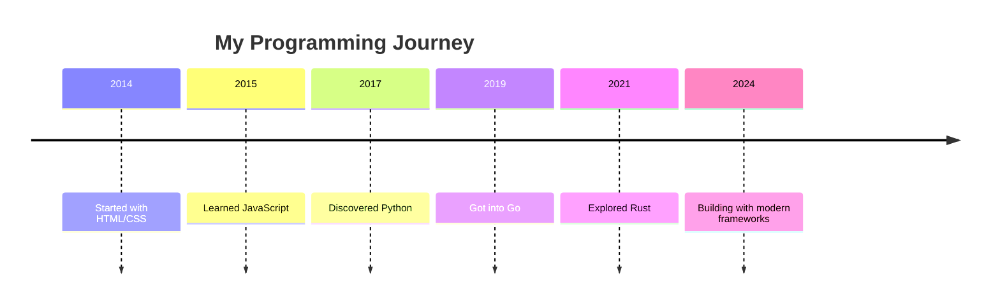

# About Me

Hello! I'm a passionate developer who loves building things with code.

## My Journey

I've been programming for over 10 years, starting with simple HTML and CSS, and gradually expanding into more complex technologies. Here's a timeline of my learning journey:

## Skills & Technologies

### Languages
- **Go** - My current favorite for backend development
- **JavaScript/TypeScript** - For frontend and full-stack projects
- **Python** - Great for data science and automation
- **Rust** - Learning for systems programming

### Tools & Frameworks
- **Web Frameworks**: Gin, Echo, Fiber (Go), Express (Node.js)
- **Databases**: PostgreSQL, MongoDB, Redis
- **DevOps**: Docker, Kubernetes, AWS
- **Version Control**: Git, GitHub, GitLab

## Current Projects

Here are some things I'm working on:

- [ ] **Personal Blog** - This very site you're reading
- [x] **API Service** - RESTful API built with Go
- [ ] **Mobile App** - React Native application
- [x] **Open Source Library** - Utility functions for Go developers

## Contact

Feel free to reach out if you'd like to connect:

- **Email**: hello@example.com
- **GitHub**: [@username](https://github.com/username)
- **Twitter**: [@username](https://twitter.com/username)
- **LinkedIn**: [linkedin.com/in/username](https://linkedin.com/in/username)

## Fun Facts

- 🐧 I use Linux as my primary operating system
- ☕ I drink way too much coffee
- 🎮 I enjoy indie games in my spare time
- 📚 I'm always reading at least 2-3 books
- 🌱 I'm passionate about sustainable technology

---

*Thanks for taking the time to learn more about me! I hope you find the content on this site useful and interesting.*
